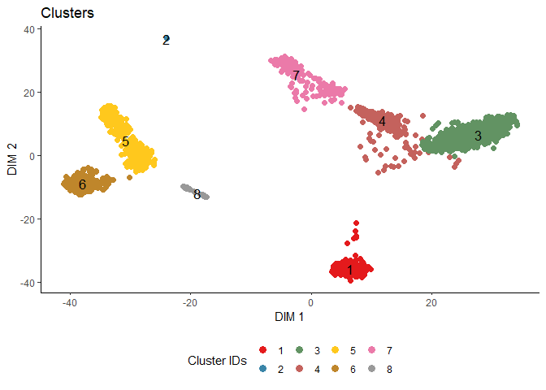
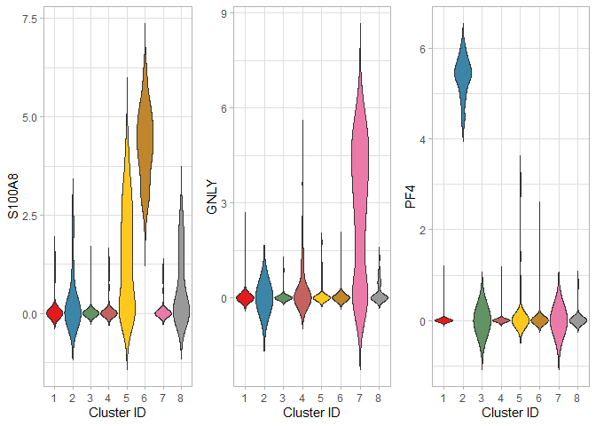
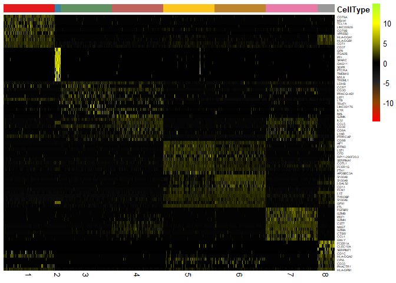

dropClust for Single Cell Transcriptome analysis
================

This latest version of dropClust has been re-implemented to include new
features and performance improvements. This vignette uses a small data
set from the 10X website (3K PBMC dataset
[here](http://cf.10xgenomics.com/samples/cell-exp/1.1.0/pbmc3k/pbmc3k_filtered_gene_bc_matrices.tar.gz)
) to demonstrate a standard pipeline. This vignette can be used as a
tutorial as well.

## Setting up

``` r
library(dropClust)
set.seed(0)
```

## Loading data

dropClust loads UMI count expression data from three input files. The
files follow the same structure as the datasets available from the 10X
website, i.e.:

  - count matrix file in sparse format
  - transcriptome identifiers as a TSV file and
  - gene identifiers as a TSV file

<!-- end list -->

``` r
# Load Data
# path contains decompressed files 
sce <-readfiles(path = "C:/Projects/dropClust/data/pbmc3k/hg19/")
#> 2700 Cells and 32738 genes present.
```

## Pre-processing

dropClust performs pre-processing to remove poor quality cells and
genes. dropClust is also equipped to mitigate batch-effects that may be
present. The user does not need to provide any information regarding the
source of the batch for individual transcriptomes. However, the
batch-effect removal step is optional.

Cells are filtered based on the total UMI count in a cell specified by
parameter `min_count`. Poor quality genes are removed based on the
minimum number of cells `min_count` with expressions above a given
threshold `min_count`.

``` r
# Filter poor quality cells.  A threshold th corresponds to the total count of a cell.
sce<-FilterCells(sce)
#> 3 bad cells removed.
sce<-FilterGenes(sce)
#> 30505 genes filtered out, 2233 genes remaining.
```

### Data normalization

Count normalization is then performed with the good quality genes only.
Normalized expression values is computed on the raw count data in a
SingleCellExperiment object, using the median normalized total count.

``` r
sce<-CountNormalize(sce)
```

### Selecting highly variable genes

Further gene selection is carried out by ranking the genes based on its
dispersion index.

``` r
sce<-RankGenes(sce, ngenes_keep = 1000)
#> Sort Top Genes...
#> Cutoff Genes...
```

## Structure Preserving Sampling

Primary clustering is performed in a fast manner to estimate a gross
structure of the data. Each of these clusters is then sampled to fine
tune the clustering process.

``` r
sce<-Sampling(sce)
#> Building graph with 2697 nodes...Louvain Partition...Done.
#> 1261 samples extracted.
```

### Gene selection based on PCA

Another gene selection is performed to reduce the number of dimensions.
PCA is used to identify genes affecting major components.

``` r
# Find PCA top 200 genes. This may take some time.
sce<-RankPCAGenes(sce)
#> Find best PCA components...[1] 1261 1000
```

<!-- -->

    #> 200 genes selected.

## Perform clustering

### Fine tuning the clustering process

By default best-fit, Louvain based clusters are returned. However, the
user can tune the parameters to produce the desired number of clusters.
The un-sampled transcriptomes are assigned cluster identifiers from
among those identifiers produced from fine-tuning clustering. The
post-hoc assignment can be controlled by setting the confidence value
`conf`. High `conf` values will assign cluster identifiers to only those
transcriptomes sharing a majority of common nearest neighbours.

``` r
sce<-Cluster(sce, method = "default", conf = 0.5)
#> 1261 samples and 200 genes used for clustering.
#> Build Graph with 1261 samples...Done.
#> Louvain Partitioning...Done.
#> Find nearest neighbours among sub-samples...Done.
#> Post-hoc Cluster Assignment...Done.
#> Unassigned Cells 14 
#> Number of Predicted Clusters: 8
```

## Visualizing clusters

Compute 2D embeddings for samples followed by post-hoc clustering.

``` r
sce<-PlotEmbedding(sce, embedding = "umap", spread = 10, min_dist = 0.1)
#> UMAP Embedding...Done.
#> Post-hoc co-ordinate assignment...Done.
ScatterPlot(sce,title = "Clusters")
```

<!-- -->

## Find cluster specific Differentially Expressed genes

``` r

DE_genes_all = FindMarkers(sce, selected_clusters=NA, lfc_th = 1, q_th =0.001, nDE=30)
#> Computing for DE genes:
#> Cluster 1 :
#>  Computing Wilcoxon p values...Done.
#>  Computing Log fold change values...Done.
#> Cluster 2 :
#>  Computing Wilcoxon p values...Done.
#>  Computing Log fold change values...Done.
#> Cluster 3 :
#>  Computing Wilcoxon p values...Done.
#>  Computing Log fold change values...Done.
#> Cluster 4 :
#>  Computing Wilcoxon p values...Done.
#>  Computing Log fold change values...Done.
#> Cluster 5 :
#>  Computing Wilcoxon p values...Done.
#>  Computing Log fold change values...Done.
#> Cluster 6 :
#>  Computing Wilcoxon p values...Done.
#>  Computing Log fold change values...Done.
#> Cluster 7 :
#>  Computing Wilcoxon p values...Done.
#>  Computing Log fold change values...Done.
#> Cluster 8 :
#>  Computing Wilcoxon p values...Done.
#>  Computing Log fold change values...Done.

write.csv(DE_genes_all$genes, 
          file = file.path(tempdir(),"ct_genes.csv"),
          quote = FALSE)
```

## Plot hand picked marker genes

``` r

marker_genes = c("S100A8", "GNLY", "PF4")

p<-PlotMarkers(sce, marker_genes)
#> Warning in regularize.values(x, y, ties, missing(ties)): collapsing to
#> unique 'x' values

#> Warning in regularize.values(x, y, ties, missing(ties)): collapsing to
#> unique 'x' values

#> Warning in regularize.values(x, y, ties, missing(ties)): collapsing to
#> unique 'x' values
```

<!-- -->

## Heat map of top DE genes from each cluster

``` r
# Draw heatmap
#############################
p<-PlotHeatmap(sce, DE_res = DE_genes_all$DE_res,nDE = 10)

print(p)
```

<!-- -->
